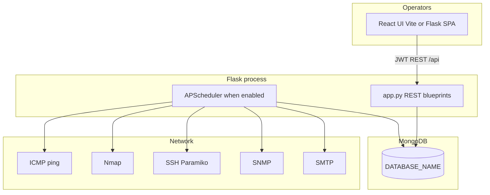

# NetPulse Network Monitoring System
## Complete User & Administrator Manual

**Document Type:** Official User Manual
**System:** NetPulse
**Generated From:** Current repository implementation
**Documentation Date:** 18 August 2026
**Status:** Implementation-aligned documentation

> This manual documents the behavior, configuration, deployment, operation, and troubleshooting procedures verified from the current NetPulse source code and project configuration.

> Screenshot: Login page — add current production screenshot here.

---

# Document Information

| Field | Value |
| ----- | ----- |
| Product | NetPulse Network Monitor |
| Audience | Operators, administrators, and deployment engineers |
| Source of truth | This repository (Flask backend, React frontend, MongoDB schema in code) |
| Documentation date | 18 August 2026 |
| Secrets policy | Real passwords, JWT secrets, encryption keys, and connection credentials are never printed. Use placeholders such as `<YOUR_SECRET>`. |

This document describes the **current implementation**. Where a value is only a seed for first boot, or cannot be confirmed from the repository, that is stated explicitly.

---

# Purpose of This Manual

This manual exists so a new administrator can:

1. Install prerequisites
2. Configure environment variables
3. Start MongoDB, the backend, the scheduler, and the frontend
4. Log in and change bootstrap passwords
5. Add and monitor devices
6. Run discovery, SSH interface inventory, and topology
7. Understand ping status, interface metrics, alerts, reports, and storm protection
8. Back up and restore MongoDB
9. Troubleshoot operational failures
10. Deploy to a VM or production host using the process models that exist in this repository

It is not a marketing overview. It is not a promise of production readiness. Documentation of a feature does not mean the feature has been certified for a specific network.

---

# Intended Audience

| Role | What this manual expects you to do |
| ---- | ---------------------------------- |
| **User** | Dashboards, devices, interfaces, topology, history, alerts, and reports, plus on-demand ping, Nmap, ISP ping, alert acknowledge/dismiss, and selected interface shutdown/recover actions. |
| **Admin** | User tasks plus device CRUD, CSV import, discovery, settings, user list/update, SSH discovery, storm evaluate/prepare/mitigate/recover. |
| **Deployment engineer** | Install Python, Node.js, MongoDB, Nmap; configure `.env`; run Gunicorn / `run_scheduler.py`; place a reverse proxy in front of the API. |

NetPulse roles inherit privileges: `admin` ⊃ `user`.

---

# Quick Start

Use this path for a **local development** install on the machine that will run NetPulse. Production differs (see [Production Deployment](#production-deployment)).

### Windows

```powershell
# 1. Start MongoDB locally (service name and install path are not defined in this repository).
#    Verify this value in the deployment environment before production use.

# 2. Backend
cd "D:\Network Monitor\NetPulse\backend"
python -m venv venv
.\venv\Scripts\activate
pip install -r requirements.txt
# Copy .env.example to .env and set MONGO_URI, DATABASE_NAME, JWT_SECRET, SECRETS_ENCRYPTION_KEY
python app.py
```

```powershell
# 3. Frontend (second terminal)
cd "D:\Network Monitor\NetPulse\frontend"
npm install
npm run dev
```

### Linux

```bash
cd backend
python -m venv venv
source venv/bin/activate
pip install -r requirements.txt
# Copy .env.example to .env and configure required variables
python app.py
```

```bash
cd frontend
npm install
npm run dev
```

4. Confirm MongoDB is reachable. Backend startup prints `MongoDB Connected Successfully!` and `Database: <DATABASE_NAME>`.
5. Open the UI:

```text
http://127.0.0.1:5173
```

The Vite dev server proxies `/api` and `/health` to `http://127.0.0.1:5000`.

6. Log in. On an **empty** `users` collection with `FLASK_DEBUG=true`, default lab accounts are created (see [First-Time Setup](#first-time-setup)). Production refuses well-known bootstrap passwords.
7. If `mustChangePassword` is true, the UI forces `/account` until you set a new password.
8. Add devices on **Ping Monitoring → Devices**.
9. Leave **Monitor** enabled so the dispatcher claims the device.
10. Confirm status becomes `Online` after successful ICMP.
11. For switches: set SSH credentials, then **Storm Protection → Interfaces → Discover all**.
12. Open **Topology** after CDP/LLDP neighbors exist on `interfaces`.
13. Review **Alerts** and **Reports**.

### Browser

```text
Development UI:  http://127.0.0.1:5173
Backend API:     http://127.0.0.1:5000
Health:          http://127.0.0.1:5000/health
Liveness:        http://127.0.0.1:5000/health/live
Readiness:       http://127.0.0.1:5000/health/ready
```

If `frontend/dist` exists, Flask also serves the SPA at `http://127.0.0.1:5000`.

---

# NetPulse Overview

NetPulse is a full-stack LAN monitoring and switch storm-protection system. It:

- Stores inventory in MongoDB
- Pings devices on a per-device cadence using ICMP (`ping3`)
- Optionally profiles Online devices with Nmap
- Discovers hosts on configured subnets
- Inventories switch interfaces over SSH
- Collects interface counters (SNMP preferred, SSH fallback)
- Builds CDP/LLDP topology graphs on read from `interfaces.neighbor`
- Scores Layer-2 storm risk and can shut / recover ports
- Shows results in a React operations UI authenticated with JWT

There is **no WebSocket live feed**. The UI polls REST APIs on fixed intervals.

---

# System Architecture



### Request flow (typical)

```text
Browser (React)
   ↓  Authorization: Bearer <JWT>
Flask blueprint under /api
   ↓
Service layer
   ↓
MongoDB and/or ICMP / SSH / SNMP / Nmap / SMTP
   ↓
JSON response
   ↓
TanStack Query cache → UI
```

### Process models that exist in code

| Mode | How it is selected | What starts |
| ---- | ------------------ | ----------- |
| Combined (`NETPULSE_ROLE=all`, default) | `python app.py` or Gunicorn with one worker | HTTP API + APScheduler in the same process |
| API only (`NETPULSE_ROLE=api`) | Env on the Gunicorn/API process | HTTP only; no APScheduler |
| Scheduler only | `python run_scheduler.py` (sets `NETPULSE_ROLE=scheduler`) | Scheduler + bootstrap; blocks on a thread event (no HTTP server in that entrypoint’s main loop) |

MongoDB scheduler leadership (`scheduler_locks`) is the final authority if more than one scheduler process exists.

---

# System Components

| Component | Location | Role |
| --------- | -------- | ---- |
| Flask application | `backend/app.py` | REST API, bootstrap, indexes, optional SPA hosting |
| APScheduler | `backend/scheduler.py` | Ping dispatch, ISP ping, Nmap, SSH discovery, stats, storm jobs, recovery, retention |
| Dedicated scheduler entry | `backend/run_scheduler.py` | Production Option A scheduler process |
| Gunicorn config | `backend/gunicorn.conf.py` | WSGI bind/workers/timeouts |
| React UI | `frontend/` | Operations console |
| MongoDB | Connection from `MONGO_URI` / `DATABASE_NAME` | Inventory, history, storm state, users |
| Logs | `backend/logs/monitor.log` | Application log (also printed to console) |

**Not included in the current repository:** Dockerfiles, Docker Compose, systemd unit files, Nginx site configs, IIS site configs, Windows service wrappers.

---

# Features

Verified product surfaces:

| Feature | Present |
| ------- | ------- |
| JWT login, roles, forced password change | Yes |
| Device inventory CRUD + CSV import | Yes |
| ICMP monitoring (dispatch mode default; legacy wave optional) | Yes |
| Manual ping / ping-all (`user` or `admin`) | Yes |
| Nmap scan (`user` or `admin`) | Yes |
| Subnet discovery + saved network profiles (admin) | Yes |
| ISP upstream ping slots (max 3) | Yes |
| SSH interface discovery | Yes |
| SNMP/SSH interface statistics | Yes |
| CDP/LLDP topology (Level 1 switch view, Level 2 full graph) | Yes |
| Storm eligibility → risk → confirmation → safety → prepare → mitigation → recovery | Yes |
| In-app alerts + optional SMTP | Yes |
| Enterprise reports (executive, availability, performance, alerts, storm) | Yes |
| CSV/XLSX export | Yes |
| Settings (ping, SMTP, storm email, recovery protection, retention) | Yes |
| User list and update (admin+); no create-user API | Yes / no POST `/api/users` |
| Health endpoints | Yes |
| Audit log writes | Yes (`auditLogs`) |

---

# Prerequisites

Verified from `backend/requirements.txt`, `frontend/package.json`, README, and runtime code:

| Prerequisite | Notes |
| ------------ | ----- |
| Python | README states **3.10+**. `requirements.txt` does not pin a Python version. Verify the interpreter before production use. |
| Node.js | README states **18+**. `frontend/package.json` has **no** `engines` field. |
| npm | Used by frontend scripts (`npm install`, `npm run dev`, `npm run build`). |
| MongoDB | Required. Version is **not specified** in the repository. `MONGO_URI` and `DATABASE_NAME` are required at backend import. |
| Nmap binary | Required for Nmap features. Path via `PATH` or `NMAP_PATH`. |
| ICMP | Windows typically needs an elevated process for `ping3`. |
| SSH reachability | Required for interface discovery, stats fallback, mitigation, and recovery. |
| SNMP | Preferred transport for interface statistics (default community seed `public`). |

---

# Hardware Requirements

The repository does not define a certified hardware BOM.

`backend/config/mongo_config.py` comments describe conservative Mongo pool defaults for **a single backend + scheduler process serving ~500 devices and ~40 switches**. That is an implementation comment, not a measured guarantee.

Recommended infrastructure practice (not a project-enforced spec):

- Dedicated VM or host for MongoDB + application
- Enough RAM for MongoDB working set plus Python workers
- Disk for MongoDB data, `backend/logs/monitor.log`, and TTL history (`dataRetentionDays` default 90)

Verify sizing in the deployment environment before production use.

---

# Software Requirements

### Backend Python packages (exact pins from `backend/requirements.txt`)

| Package | Version constraint |
| ------- | ------------------ |
| Flask | 3.1.3 |
| flask-cors | 6.0.5 |
| gunicorn | 23.0.0 |
| APScheduler | 3.11.3 |
| pymongo | 4.17.0 |
| PyJWT | 2.13.0 |
| bcrypt | 5.0.0 |
| cryptography | >=42.0.0 |
| paramiko | >=2.12.0,<3 |
| ping3 | 5.1.5 |
| python-nmap | >=0.7.1 |
| pysnmp | >=7.1.0 |
| python-dotenv | 1.2.2 |
| openpyxl | 3.1.5 |
| Werkzeug | 3.1.8 |

### Frontend (from `frontend/package.json`)

| Item | Value |
| ---- | ----- |
| Name | `frontend` |
| Private | true |
| React | ^19.2.7 |
| Vite | ^8.1.1 |
| TypeScript | ~6.0.2 |
| TanStack Query | ^5.90.2 |
| React Router | ^7.18.1 |
| Tailwind CSS | ^4.1.13 |
| Recharts | ^3.9.2 |
| @xyflow/react | ^12.11.2 |

Scripts: `dev`, `build` (`tsc -b && vite build`), `lint`, `preview`, `test`.

---

# Network Requirements

NetPulse must be able to:

| Traffic | Direction | Purpose |
| ------- | --------- | ------- |
| ICMP echo | NetPulse host → monitored IPs and ISP targets | Reachability |
| TCP 22 (default SSH) | NetPulse host → switches | Discovery, SSH stats, mitigation, recovery |
| UDP 161 (default SNMP) | NetPulse host → switches | Interface counters |
| TCP to Nmap targets | NetPulse host → Online devices | Optional profiling |
| TCP to MongoDB | Application → MongoDB | Persistence (default Mongo port 27017 if URI uses it) |
| TCP SMTP | Application → mail host | Optional alerts (default seed port 587) |
| HTTP(S) | Browsers → UI/API | Operators |

Devices must permit ICMP from the NetPulse host. Switches must permit SSH (and SNMP if used) from the NetPulse host.

CDP/LLDP must be enabled on switches if topology neighbors are required. SNMP is **not** used to build topology neighbors.

---

# Required Ports

| Port | Component | Source of truth |
| ---- | --------- | --------------- |
| **5000** | Flask / Gunicorn default | `FLASK_RUN_PORT` default `5000`; `GUNICORN_BIND` default `127.0.0.1:5000` |
| **5173** | Vite development UI | `frontend/vite.config.ts` `server.port` |
| **27017** | MongoDB default if URI omits port | `config/mongo_config.py` log helper uses `parsed.port or 27017` |
| **22** | SSH default | `SSH_DEFAULT_PORT` default 22; per-device `credentials.sshPort` |
| **161** | SNMP default | `SNMP_DEFAULT_PORT` default 161 |
| **587** | SMTP seed | `SMTP_PORT` default 587 |

Production should not expose Flask/Gunicorn on `0.0.0.0` without TLS termination in front. Debug mode always binds Flask to `127.0.0.1`.

---

# Installation

## Python virtual environment

### Windows

```powershell
cd backend
python -m venv venv
.\venv\Scripts\activate
pip install -r requirements.txt
```

### Linux

```bash
cd backend
python -m venv venv
source venv/bin/activate
pip install -r requirements.txt
```

## Node.js frontend

```bash
cd frontend
npm install
```

Development:

```bash
npm run dev
```

Production static build (Flask can serve `frontend/dist`):

```bash
npm run build
```

## MongoDB Setup

1. Install MongoDB Community or use a reachable instance. **MongoDB version is not specified in this repository.**
2. Create `backend/.env` from `backend/.env.example`.
3. Set:

```env
MONGO_URI=mongodb://127.0.0.1:27017
DATABASE_NAME=NetworkMonitor
```

`MONGO_URI` and `DATABASE_NAME` have **no code defaults**. Importing `config.database` raises `ValueError` if either is missing.

4. Optional authentication belongs in `MONGO_URI` (do not paste real credentials into this manual).
5. MongoDB Compass is **not referenced** by the application. Operators may use it as an external tool.

On successful connect the backend prints:

```text
MongoDB Connected Successfully!
Database: <DATABASE_NAME>
Mongo pool | host=... maxPoolSize=... waitQueueTimeoutMS=...
```

Indexes are created at bootstrap (devices, ping history, storm collections, TTL, login rate limit, reports, and others). See [Database Administration](#database-administration).

---

# Backend Setup

1. Create and activate the venv (above).
2. Copy `backend/.env.example` → `backend/.env`.
3. Set required secrets (see [Environment Configuration](#environment-configuration)).
4. Start with `python app.py` (development) or Gunicorn (production).

API base: `http://127.0.0.1:5000` unless `FLASK_RUN_HOST` / `FLASK_RUN_PORT` / `GUNICORN_BIND` change it.

---

# Frontend Setup

1. `npm install` in `frontend/`.
2. Development: `npm run dev` → `http://127.0.0.1:5173` with proxy to Flask.
3. Production UI option A: `npm run build`, then run Flask so it serves `frontend/dist`.
4. Production UI option B: host `dist/` behind the same origin as the API, or set `CORS_ALLOWED_ORIGINS` to the UI origin.

There is no frontend `.env` required for the proxy. The login page does not display, auto-fill, or hint account passwords.

---

# Environment Configuration

Copy `backend/.env.example` to `backend/.env`. Never commit real secrets.

Runtime source of truth for ping/SMTP/storm recovery settings is the MongoDB `settings` document (`_id: "global"`) after first boot. Changing ping env vars later **does not rewrite** an existing settings document (except a one-time cadence migration described in `.env.example`).

### Environment variable table

Examples use placeholders, not real secrets.

| Variable | Required | Purpose | Default (when unset) | Example | Production notes |
| -------- | -------- | ------- | -------------------- | ------- | ---------------- |
| `MONGO_URI` | Yes | MongoDB connection URI | none (raises) | `mongodb://127.0.0.1:27017` | Use auth; do not expose 27017 to the Internet |
| `DATABASE_NAME` | Yes | Database name | none (raises) | `NetworkMonitor` | |
| `FLASK_DEBUG` | No | Werkzeug debug; CORS/dev JWT fallback | `false` | `true` (lab only) | Never enable on a shared host |
| `FLASK_RUN_HOST` | No | `python app.py` bind | `127.0.0.1` | `127.0.0.1` | Debug always forces `127.0.0.1` |
| `FLASK_RUN_PORT` | No | `python app.py` port | `5000` | `5000` | |
| `NETPULSE_ENV` | No | Environment label | `production` when debug is off and unset | `production` | Unset + debug off = production CORS rules |
| `NETPULSE_ROLE` | No | `all` \| `api` \| `scheduler` | `all` | `api` | Invalid values fall back to `all` |
| `NETPULSE_ENABLE_SCHEDULER` | No | `true` \| `false` \| `auto` | `auto` | `false` | `auto` disables scheduler when Gunicorn workers > 1 |
| `CORS_ALLOWED_ORIGINS` | Production yes | Comma-separated browser origins | Dev: localhost 5173/5000 | `https://netpulse.example.com` | Required in production; no wildcard with credentials |
| `JWT_SECRET` | Production yes | JWT HMAC secret | Debug fallback `netpulse-dev-secret-change-me` | `<YOUR_SECRET>` | ≥32 chars, not a placeholder |
| `JWT_EXPIRE_HOURS` | No | Token lifetime | `8` | `8` | |
| `SECRETS_ENCRYPTION_KEY` | Production yes | Fernet key for SSH/SMTP/SNMP secrets | none | `<YOUR_FERNET_KEY>` | Keep stable; rotation breaks decrypt |
| `DEFAULT_ADMIN_USER` | Empty DB | Bootstrap admin username | `admin` | `admin` | |
| `DEFAULT_ADMIN_PASSWORD` | Empty DB in production | Bootstrap admin password | debug: `admin123` | `<YOUR_SECRET>` | Production: min 12 chars, not well-known |
| `DEFAULT_USER_NAME` | Empty DB | Bootstrap user username | `user` | `user` | |
| `DEFAULT_USER_PASSWORD` | Empty DB in production | Bootstrap user password | debug: `user123` | `<YOUR_SECRET>` | Same production rules; `DEFAULT_VIEWER_PASSWORD` is a legacy alias |
| `MAX_CONTENT_LENGTH` | No | Flask max request body bytes | `2097152` (2 MiB), min 64 KiB | `2097152` | |
| `MAX_CSV_UPLOAD_BYTES` | No | CSV import cap | `1048576` | `1048576` | |
| `LOGIN_MAX_FAILURES` | No | Brute-force threshold | `8` | `8` | |
| `LOGIN_WINDOW_SECONDS` | No | Failure window | `900` | `900` | |
| `LOGIN_LOCKOUT_SECONDS` | No | Lockout duration | `900` | `900` | |
| `SCAN_INTERVAL` | Seed only | Default `settings.pingInterval` | `60` | `60` | Runtime SoT is Mongo settings |
| `PING_TIMEOUT_MS` | Seed only | Default ping timeout ms | `1000` | `1000` | Min 100 via API |
| `PING_RETRIES` | Seed only | **Total ICMP attempts per scan** | `3` | `3` | Not “retries after first” |
| `PING_FAILURE_CONFIRMATION_SCANS` | Seed only | Failed **scans** before leaving Online | `2` | `2` | Separate from alert threshold 3 |
| `MONITOR_PING_CONCURRENCY` | Seed only | Max parallel ping workers | `40` | `40` | Clamped 1–64 at read |
| `MONITOR_RUNTIME_MODE` | No | `dispatch` or `legacy` | `dispatch` | `dispatch` | Unknown → dispatch |
| `MONITOR_DISPATCHER_INTERVAL_SECONDS` | No | Dispatcher tick (dispatch mode) | `5` | `5` | Clamped **1–15** |
| `PING_CLAIM_TTL` | No | Optional claim TTL floor seconds | computed | `30` | Else `max(15, (timeout_ms/1000)*retries + 10)` |
| `SCHEDULER_LOCK_TTL_SECONDS` | No | Leader-election lease | `90` | `90` | Min 15 |
| `MONITOR_CONNECTIVITY_PROBE_HOST` | No | Partition probe host | empty (disabled) | gateway IP | Failed probe suppresses mass offline writes |
| `MONITOR_CONNECTIVITY_PROBE_TIMEOUT_MS` | No | Probe timeout | `800` | `800` | |
| `ALERT_EMAIL_ENABLED` | Seed | SMTP enabled flag | `true` | `true` | |
| `ALERT_EMAIL_TO` | Optional | Alert recipient | empty | `ops@example.com` | |
| `SMTP_HOST` | Seed | SMTP host | `smtp.gmail.com` | `smtp.example.com` | |
| `SMTP_PORT` | Seed | SMTP port | `587` | `587` | |
| `SMTP_USER` | Optional | SMTP username | empty | | |
| `SMTP_PASSWORD` | Optional | SMTP password | empty | `<YOUR_SECRET>` | Encrypted at rest when stored |
| `SMTP_FROM` | Optional | From address | `SMTP_USER` | | |
| `SMTP_USE_TLS` | Seed | TLS | `true` | `true` | |
| `NMAP_SCAN_INTERVAL` | No | Scheduled Nmap period seconds | `3600` | `3600` | |
| `NMAP_ARGUMENTS` | No | Deep Nmap flags | `-A -T4` | `-sV -T4` | Validated at startup |
| `NMAP_QUICK_ARGUMENTS` | No | Quick profile | `-O -sV -T4 --top-ports 100` | | Validated at startup |
| `MAX_SCAN_THREADS` | No | Concurrent Nmap | `5` | `5` | |
| `NMAP_TIMEOUT` | No | Per-host Nmap timeout seconds | `300` | `300` | |
| `NMAP_CACHE_TTL` | No | Reuse recent Nmap results seconds | `21600` | `21600` | `0` disables |
| `NMAP_PATH` | No | nmap binary path | empty (PATH) | `C:\Program Files (x86)\Nmap\nmap.exe` | |
| `INTERFACE_SCAN_INTERVAL` | No | SSH discovery period | `3600` | `3600` | `0` disables schedule |
| `MAX_INTERFACE_THREADS` | No | Concurrent SSH discovery | `5` | `5` | |
| `INTERFACE_STATS_INTERVAL` | No | Stats poll period | `60` | `60` | `0` disables schedule |
| `MAX_INTERFACE_STATS_THREADS` | No | Concurrent stats polls | `8` | `8` | |
| `INTERFACE_STATS_BATCH_SIZE` | No | Stats insert chunk | `500` | `500` | |
| `MAC_ARP_POLL_INTERVAL` | No | MAC/ARP poll seconds | `90` | `90` | |
| `MAX_MAC_ARP_POLL_THREADS` | No | MAC/ARP threads | `5` | `5` | |
| `ARP_ACTIVE_SWEEP_INTERVAL` | No | Active ARP sweep seconds | `1800` | `1800` | `0` disables |
| `ARP_ACTIVE_SWEEP_MAX_HOSTS` | No | Max hosts per subnet per sweep | `512` | `512` | |
| `SSH_DEFAULT_USERNAME` | No | Fallback SSH user | empty | | Prefer per-device creds |
| `SSH_DEFAULT_PASSWORD` | No | Fallback SSH password | empty | `<YOUR_SECRET>` | |
| `SSH_DEFAULT_PORT` | No | Fallback SSH port | `22` | `22` | |
| `SSH_DEFAULT_SECRET` | No | Fallback enable secret | empty | | |
| `SSH_DEFAULT_VENDOR` | No | Fallback vendor key | `cisco_ios` | `cisco_ios` | |
| `SSH_TIMEOUT` | No | SSH timeout seconds | `30` | `30` | |
| `SSH_KNOWN_HOSTS_FILE` | No | known_hosts path | empty | `known_hosts` | Production uses RejectPolicy |
| `SSH_ALLOW_UNKNOWN_HOSTS` | No | Allow unknown SSH keys | false | `true` | Only with `FLASK_DEBUG=true` |
| `SNMP_DEFAULT_COMMUNITY` | No | Fallback community | `public` | `public` | Encrypted if stored on device |
| `SNMP_DEFAULT_VERSION` | No | SNMP version | from env / device | `2c` | |
| `SNMP_DEFAULT_PORT` | No | SNMP port | `161` | `161` | |
| `SNMP_TIMEOUT` | No | SNMP timeout | `3` | `3` | |
| `SNMP_RETRIES` | No | SNMP retries | `1` | `1` | |
| `DATA_RETENTION_DAYS` | Seed | History TTL days | `90` | `90` | Min 7, max 3650 via API |
| `INCIDENT_RETENTION_DAYS` | Seed | Closed incident / action log days | `365` | `365` | Min 30 |
| `GUNICORN_BIND` | No | Bind address | `127.0.0.1:5000` | `127.0.0.1:5000` | |
| `GUNICORN_WORKERS` | No | Worker count | `1` | `1` | >1 forces API role in gunicorn.conf.py |
| `GUNICORN_TIMEOUT` | No | Worker timeout seconds | `120` | `120` | |
| `GUNICORN_GRACEFUL_TIMEOUT` | No | Graceful timeout | `30` | `30` | |
| `GUNICORN_KEEPALIVE` | No | Keepalive | `5` | `5` | |
| `WEB_CONCURRENCY` | No | Also used to detect multi-worker | unset | | |
| `MONGO_MAX_POOL_SIZE` | No | PyMongo max pool | `50` (min 10) | `50` | |
| `MONGO_MIN_POOL_SIZE` | No | Min pool | `0` | `0` | |
| `MONGO_MAX_IDLE_TIME_MS` | No | Max idle | `60000` | `60000` | |
| `MONGO_WAIT_QUEUE_TIMEOUT_MS` | No | Wait queue | `10000` | `10000` | |
| `MONGO_SERVER_SELECTION_TIMEOUT_MS` | No | Server selection | `5000` | `5000` | |
| `MONGO_CONNECT_TIMEOUT_MS` | No | Connect timeout | `20000` | `20000` | |
| `MONGO_SOCKET_TIMEOUT_MS` | No | Socket timeout | `20000` | `20000` | |
| `MONGO_RETRY_WRITES` | No | Retry writes | `true` | `true` | |
| `MONGO_RETRY_READS` | No | Retry reads | `true` | `true` | |
| `MAX_GLOBAL_SSH_SESSIONS` | No | Global collector SSH slots | `10` | `10` | Clamped 1–64 |
| `SSH_SLOT_WAIT_SECONDS` | No | Wait for SSH slot | `30` | `30` | |
| `STORM_ENABLE_ELIGIBILITY` | No | Eligibility master switch | `true` | `true` | |
| `STORM_ALLOW_MANAGEMENT_PORTS` | No | Eligibility override | `false` | `false` | |
| `STORM_ALLOW_TRUNKS` | No | Eligibility override | `false` | `false` | |
| `STORM_ALLOW_INFRASTRUCTURE_PORTS` | No | Eligibility override | `false` | `false` | |
| `STORM_ALLOW_PROTECTED_PORTS` | No | Eligibility override | `false` | `false` | |
| `STORM_ELIGIBILITY_CONFIDENCE` | No | Confidence 0–100 | `100` | `100` | |
| `STORM_ENABLE_RISK` | No | Risk engine | `true` | `true` | |
| `STORM_WEIGHT_BROADCAST` | No | Risk weight | `35` | `35` | |
| `STORM_WEIGHT_MULTICAST` | No | Risk weight | `15` | `15` | |
| `STORM_WEIGHT_UNKNOWN_UNICAST` | No | Risk weight | `15` | `15` | |
| `STORM_WEIGHT_UTILIZATION` | No | Risk weight | `10` | `10` | |
| `STORM_WEIGHT_ERRORS` | No | Risk weight | `10` | `10` | |
| `STORM_WEIGHT_DISCARDS` | No | Risk weight | `5` | `5` | |
| `STORM_WEIGHT_CRC` | No | Risk weight | `5` | `5` | |
| `STORM_THRESH_BROADCAST_LOW` / `_MEDIUM` / `_HIGH` / `_CRITICAL` | No | Broadcast pps bands | 50 / 200 / 1000 / 5000 | | |
| `STORM_THRESH_MULTICAST_*` | No | Multicast pps bands | 100 / 500 / 2000 / 8000 | | |
| `STORM_THRESH_UNKNOWN_UNICAST_*` | No | Unknown unicast pps bands | 50 / 200 / 1000 / 5000 | | |
| `STORM_THRESH_UTILIZATION_*` | No | Utilization % bands | 30 / 50 / 75 / 90 | | |
| `STORM_THRESH_ERRORS_*` | No | Error rate bands | 1 / 5 / 20 / 50 | | |
| `STORM_THRESH_DISCARDS_*` | No | Discard rate bands | 1 / 10 / 50 / 200 | | |
| `STORM_THRESH_CRC_*` | No | CRC rate bands | 1 / 5 / 20 / 50 | | |
| `STORM_CONFIRMATION_ENABLED` | No | Confirmation engine | `true` | `true` | |
| `STORM_REQUIRED_CONFIRMATIONS` | No | Consecutive high-risk cycles | `2` (min 1) | `2` | |
| `STORM_CONFIRMATION_RISK_THRESHOLD` | No | Risk ≥ this counts as high | `25` | `25` | |
| `STORM_CONFIRMATION_RESET_ON_POLL_FAILURE` | No | Reset on stale stats | `true` | `true` | |
| `STORM_CONFIRMATION_RESET_ON_INELIGIBLE` | No | Reset when ineligible | `true` | `true` | |
| `STORM_CONFIRMATION_RESET_ON_LOW_RISK` | No | Reset on low risk | `true` | `true` | |
| `STORM_CONFIRMATION_POLL_STALE_SECONDS` | No | Stats older than this = poll fail | `180` (min 30) | `180` | |
| `STORM_CONFIRMATION_WORKERS` | No | Confirmation worker threads | `4` | `4` | |
| `STORM_SAFETY_ENABLED` | No | Safety engine | `true` | `true` | |
| `STORM_AUTOMATION_ENABLED` | No | Safety automation gate | `true` | `true` | |
| `STORM_COOLDOWN_MINUTES` | No | Mitigation safety cooldown | `5` | `5` | |
| `STORM_CPU_THRESHOLD` | No | CPU % fail | `90` | `90` | |
| `STORM_MEMORY_THRESHOLD` | No | Memory % fail | `90` | `90` | |
| `STORM_MAXIMUM_ATTEMPTS` | No | Max mitigation attempts | `3` | `3` | |
| `STORM_ALLOW_MANUAL_OVERRIDE` | No | Safety override flag | `false` | `false` | |
| `STORM_SAFETY_RISK_THRESHOLD` | No | Safety risk floor | `25` | `25` | |
| `STORM_SAFETY_REQUIRE_SSH` | No | Require SSH for safety | `true` | `true` | |
| `STORM_SAFETY_FAIL_OPEN_MISSING_HEALTH` | No | Fail-open if no CPU/mem | `false` | `false` | Default fail-closed |
| `STORM_SAFETY_SSH_TIMEOUT` | No | Safety SSH timeout | `15` (min 5) | `15` | |
| `STORM_SAFETY_CONFIRM_SKEW_SECONDS` | No | Safety vs confirmation skew | `120` | `120` | |
| `STORM_MITIGATION_MODE` | Seed | `manual` \| `automatic` | `manual` | `manual` | Runtime SoT is Mongo settings |
| `STORM_AUTO_RECOVERY` | Seed | Auto-recovery | `true` | `true` | Mongo settings |
| `STORM_RECOVERY_COOLDOWN_MINUTES` | Seed | Recovery cooldown | `5` | `5` | Maps to `settings.cooldownMinutes` |
| `STORM_RECOVERY_STABILIZATION_SECONDS` | Seed | MONITORING window | `60` | `60` | |
| `STORM_RECOVERY_MAX_ATTEMPTS` | Seed | Max recovery attempts | `3` | `3` | |
| `STORM_RE_MITIGATION_THRESHOLD` | Seed | Prepare / re-mitigate risk | `25` | `25` | |
| `STORM_EMAIL_ENABLED` | Seed | Storm emails | `true` | `true` | |
| `STORM_EMAIL_SHUTDOWN` | Seed | Shutdown emails | `true` | `true` | |
| `STORM_EMAIL_RECOVERY` | Seed | Recovery emails | `true` | `true` | |
| `STORM_EMAIL_FAILURE` | Seed | Failure emails | `true` | `true` | |
| `STORM_EMAIL_TO` | Optional | Storm recipient | empty (falls back to alert To) | | |
| `STORM_MITIGATION_BATCH_SIZE` | No | Auto-mitigation batch | `5` | `5` | |
| `STORM_LOCK_TTL_SECONDS` | No | Mitigation/recovery lock TTL | `300` | `300` | Min 1 |
| `STORM_LEASE_STATS_SECONDS` | No | Pipeline lease stats | `900` | | |
| `STORM_LEASE_ANALYSIS_SECONDS` | No | Pipeline lease analysis | `1200` | | |
| `STORM_LEASE_CONFIRMATION_SECONDS` | No | Pipeline lease confirmation | `900` | | |
| `STORM_LEASE_SAFETY_SECONDS` | No | Pipeline lease safety | `2700` | | |
| `STORM_CYCLE_LEASE_RECLAIM` | No | Reclaim expired cycle leases | enabled unless `0`/`false`/`no`/`off` | | |
| `STORM_RISK_LATEST` | No | Maintain `storm_risk_latest` | enabled unless disabled | | |

Generate secrets (do not use the output of these commands as documented real keys):

### Windows / Linux

```bash
python -c "import secrets; print(secrets.token_urlsafe(48))"
python -c "from cryptography.fernet import Fernet; print(Fernet.generate_key().decode())"
```

---

# Starting NetPulse

Start **MongoDB first**, then backend (and scheduler if split), then frontend (if using Vite).

## Development startup

1. MongoDB running and `MONGO_URI` valid.
2. Backend:

### Windows

```powershell
cd backend
.\venv\Scripts\activate
python app.py
```

### Linux

```bash
cd backend
source venv/bin/activate
python app.py
```

Expected: Mongo connect messages, then Flask serving on `127.0.0.1:5000` (unless host/port overridden). If `FLASK_DEBUG=true`, scheduler starts only in the Werkzeug reloader **child**.

3. Frontend:

```bash
cd frontend
npm run dev
```

Expected: Vite on port 5173.

4. Verify:

### Browser

```text
http://127.0.0.1:5173
http://127.0.0.1:5000/health/live
```

Sidebar shows **API online** / **DB connected** when `/health` reports `server: Running` and `database: Connected`.

## Production startup

See [Production Deployment](#production-deployment). Summary:

### Option A (recommended in `backend/DEPLOYMENT.md`)

API workers:

```bash
cd backend
export NETPULSE_ROLE=api
export NETPULSE_ENABLE_SCHEDULER=false
export NETPULSE_ENV=production
export CORS_ALLOWED_ORIGINS=https://netpulse.example.com
export GUNICORN_BIND=127.0.0.1:5000
gunicorn -c gunicorn.conf.py "app:app"
```

Scheduler (exactly one):

```bash
cd backend
export NETPULSE_ENV=production
python run_scheduler.py
```

### Option B (combined)

```bash
cd backend
export GUNICORN_WORKERS=1
export GUNICORN_BIND=127.0.0.1:5000
export NETPULSE_ENABLE_SCHEDULER=true
export NETPULSE_ENV=production
export CORS_ALLOWED_ORIGINS=https://netpulse.example.com
gunicorn -c gunicorn.conf.py "app:app"
```

**Never** run `GUNICORN_WORKERS>1` with the scheduler enabled in every worker. `gunicorn.conf.py` sets `NETPULSE_ROLE=api` and `NETPULSE_ENABLE_SCHEDULER=false` when workers > 1.

## API-only mode

Set `NETPULSE_ROLE=api`. `should_start_scheduler()` returns false.

## Scheduler-only mode

Run `python run_scheduler.py`. It sets `NETPULSE_ROLE=scheduler` and `NETPULSE_ENABLE_SCHEDULER=true` before importing `app`.

## Combined mode

Default `NETPULSE_ROLE=all` with `python app.py` or single-worker Gunicorn.

---

# Stopping NetPulse

There are **no Windows service names or systemd unit names** in this repository. Stop the processes you started.

| Process | How to stop |
| ------- | ----------- |
| `python app.py` | Ctrl+C in that terminal. `atexit` calls `stop_scheduler()`. |
| Gunicorn | Stop the Gunicorn master (SIGINT/SIGTERM). `on_exit` calls `stop_scheduler()`. |
| `python run_scheduler.py` | Stop that process. It waits forever on `threading.Event().wait()` until killed. |
| `npm run dev` | Ctrl+C |
| MongoDB | Stop the MongoDB service using the OS service manager. Name is not defined in this repo. |

Stopping the API does not stop MongoDB. Stopping the scheduler stops ping/storm jobs in that process; API-only processes continue to serve HTTP.

---

# Restarting NetPulse

1. Stop frontend (if Vite).
2. Stop Gunicorn / `app.py` / `run_scheduler.py`.
3. Confirm MongoDB is still running (or start it first).
4. Start scheduler (if Option A), then API, then frontend.
5. Hit `/health/ready` until `status` is `ready`.
6. Log in and confirm device `lastCheckedAt` advances.

After changing `MONITOR_DISPATCHER_INTERVAL_SECONDS`, restart the scheduler process (settings `pingInterval` does **not** retarget the dispatcher period in dispatch mode).

---

# Verifying Installation

| Check | Method |
| ----- | ------ |
| Mongo | Backend prints connected; `/health/ready` `checks.mongodb` = `ok` |
| API liveness | `GET /health/live` → `status: alive` |
| API readiness | `GET /health/ready` → `status: ready` (503 if Mongo down or expected scheduler not running) |
| Legacy health | `GET /health` → `server` / `database` |
| UI | Login page loads; after login, sidebar **API** / **DB** indicators |
| Scheduler | Logs: `Scheduler started in this process` or scheduler process boot line |
| Ping path | Add a known-online host; status becomes `Online`; `pingHistory` grows |

Admin operational snapshot: `GET /api/dashboard/ops-metrics` (admin role).

---

# First-Time Setup

1. Ensure `.env` has Mongo, JWT, and Fernet key (production).
2. Start backend once so bootstrap runs:
   - `ensure_settings()` inserts global settings
   - `ensure_default_admin()` if `users` is empty (also migrates legacy roles)
   - `ensure_isp_connections()` seeds up to three ISP slots (`isp-1`, `isp-2`, `isp-3`)
   - Indexes and TTL
3. Log in and **change passwords immediately**.
4. Configure SMTP under **Settings** if email is required.
5. Configure ISP targets under Settings → ISP section (admin).
6. Add devices and SSH credentials for switches.

### Bootstrap users (empty `users` collection only)

| Condition | Admin username | Admin password | User username | User password |
| --------- | -------------- | -------------- | ------------- | ------------- |
| `FLASK_DEBUG=true` and env passwords unset | `DEFAULT_ADMIN_USER` or `admin` | `admin123` | `DEFAULT_USER_NAME` or `user` | `user123` |
| Production-like (`FLASK_DEBUG` off) | same username | **must** be set via `DEFAULT_ADMIN_PASSWORD` (≥12 chars, not well-known) | `DEFAULT_USER_NAME` or `user` | **must** be set via `DEFAULT_USER_PASSWORD` |

Both bootstrap users are created with `mustChangePassword: true`. These values are **backend bootstrap only** — the login page never shows or fills them.

Legacy stored roles (`viewer`, `operator`, `super-admin`) are normalized to `user` or `admin` on startup.

**There is no `POST /api/users` create-user endpoint.** Admins can list and update existing users only.

---

# Authentication

### Login flow

```text
User opens /login
 ↓
Enters Username and Password
 ↓
POST /api/auth/login
 ↓
Login rate limit check (username+IP, plus username-only and IP-only counters)
 ↓
bcrypt verify against users.passwordHash
 ↓
JWT issued (HS256), stored by the frontend
 ↓
Subsequent /api calls send Authorization: Bearer <token>
```

### Login page (exact UI)

- Title: **Welcome back**
- Subtitle: **Sign in to access the operations center**
- Fields: **Username**, **Password** (show/hide)
- Submit button signs in
- Error banner shows API message (for example `Invalid username or password`, `Too many failed login attempts. Try again later.`)
- Left panel (large screens): **NetPulse** / **Network Monitor**, **Network Operations Center**

> Screenshot: Login — add current production screenshot here.

After login, if `mustChangePassword` is true, `ProtectedRoute` redirects to `/account` until the password is changed.

Token expiry default: **8 hours** (`JWT_EXPIRE_HOURS`). Expired token → `Token expired. Please log in again.`

### Account self-service

`PUT /api/auth/account` requires `currentPassword`. New username min 3 characters. New password min 6 characters and must differ from current.

---

# User Roles

| Role | Privilege set (inheritance) |
| ---- | --------------------------- |
| `user` | `user` |
| `admin` | `user` + `admin` |

### Permission matrix (API)

`require_auth()` with no roles = any authenticated user (unless password change is required). `admin` satisfies `user`-level requirements.

| Action | Minimum role |
| ------ | ------------ |
| Login, `/auth/me`, update own account | Public / self |
| Read devices, dashboard, history, reports, alerts, topology, interfaces, storm GET, settings GET, ISPs GET, networks GET, discovery hint | Any authenticated |
| Manual ping, ping-all, Nmap, ISP scan, alert ack/dismiss, interface monitoring mode, manual shutdown/recover | `user` |
| Create/update/delete devices, CSV import, discovery scan, network CRUD, settings PUT, user list/update, bulk discover/stats, storm evaluate/prepare/mitigate/recover, ops-metrics | `admin` |

Frontend: **Discovery** and **Settings** nav items are `adminOnly`. `isAdmin` is true for `admin` only. `isUser` is true for `user` and `admin`.

**Note:** `POST /api/devices/<id>/scan` requires **`user`** (or `admin`), not merely any authenticated role.

---

# Navigation and Pages

Sidebar brand: **NetPulse** / **Network Monitor**. Groups:

| Group | Items (labels) | Route |
| ----- | -------------- | ----- |
| Dashboard | Enterprise Overview | `/` |
| Ping Monitoring | Devices | `/devices` |
| | Discovery (admin) | `/discovery` |
| | History | `/history` |
| | Reports | `/reports` |
| Storm Protection | Overview | `/storm` |
| | Interfaces | `/interfaces` |
| | Topology | `/topology` |
| | Risk Analysis | `/storm?view=pipeline` |
| | Incidents | `/storm?view=incidents` |
| | Mitigation | `/storm?view=mitigation` |
| | Recovery | `/storm?view=recovery` |
| Operations | Alerts | `/alerts` |
| Administration | Users | `/account` |
| | Settings (admin) | `/settings` |

Footer: **API** / **DB** health, username, role, **Log out**.

Unknown paths redirect to `/`.

---

# Dashboard

### Page name

**Enterprise Dashboard** (`/`)

### Purpose

Fleet KPIs, health gauge, ISP connectivity, recent activity, critical alerts, quick actions.

### What the user sees

- **Ping Monitoring** KPIs from `/api/dashboard/summary`: total, online, not reachable, critical offline, unknown, monitored
- **Storm Protection** section (links into storm views)
- **Overall Network Health** gauge
- **ISP Connectivity** (up to three slots)
- **Recent Activity** (recent ping history + alerts)
- **Critical Alerts**
- **Quick Actions** (Devices, Discovery, Settings, Reports, Storm, Alerts — as rendered)

> Screenshot: Dashboard — add current production screenshot here.

### Network health (what the number means)

Frontend `computeNetworkHealth`:

```text
score = round(onlineDevices / totalDevices × 100)
```

| Score | Label |
| ----- | ----- |
| ≥ 90 | Excellent |
| ≥ 70 | Good |
| ≥ 50 | Warning |
| < 50 | Critical |

If `totalDevices` is 0 or summary is incomplete, the UI shows **100 / Excellent** (it does not invent a Critical 0%).

This is **not** an SLA and **not** time-based availability.

### Polling

Dashboard queries refetch every **15 seconds**. Health every **30 seconds**.

### User should

- Confirm counts match inventory
- Open Alerts if critical offline > 0
- Check ISP tiles if upstream monitoring is configured

---

# Device Management

## Devices page

### Page name

**Ping Monitoring · Devices** (`/devices`, optional `/devices/:deviceId`)

### Buttons (as implemented)

- **Ping all** (user or admin) — confirm dialog **Ping all devices now?**
- **Nmap scan all** (user or admin) — confirm **Run Nmap on all online devices?**
- **Import CSV** (admin)
- **Add device** (admin)

Per-row **Ping** and edit/delete actions exist on the inventory table/drawer.

> Screenshot: Devices — add current production screenshot here.

## Adding Devices

```text
Admin opens Devices
 ↓
Clicks Add device
 ↓
Dialog title: Add device
 ↓
Fills form → client Zod validation
 ↓
POST /api/devices (admin)
 ↓
Backend requires hostname, ipAddress, deviceType
 ↓
IPv4 regex check (backend does not accept IPv6 for devices)
 ↓
Unique ipAddress index
 ↓
create_device: status Unknown, consecutiveFailures 0, nextCheckAt=now if monitor
 ↓
201 Device created successfully
 ↓
Dialog closes; table refreshes
```

### Form fields (Add/Edit device dialog)

| UI label | Required in UI | Required in API | Notes |
| -------- | -------------- | --------------- | ----- |
| Hostname | Yes | Yes | |
| IP address | Yes | Yes | UI accepts IPv4 or IPv6; **API rejects non-IPv4** |
| Device type | Yes | Yes | Dropdown of canonical types; default **Server** |
| Vendor | Yes (UI) | No | Stored as `credentials.sshVendor` |
| SSH username | Yes (UI) | No | `credentials.sshUsername` |
| SSH password | Yes for **new** devices | No | Encrypted at rest; optional on edit if leaving blank |
| Critical | Checkbox | Optional, default false | Drives Offline (Critical) vs Not Reachable |
| Monitor | Checkbox, default on | Optional, default true | Unmonitored devices are not claimed by dispatcher |
| Ping interval / timeout / retries | Optional | Optional | Per-device overrides; interval min 5, timeout min 100, retries min 1 |

Canonical device types in the UI:

`Router`, `Switch`, `Managed Switch`, `Firewall`, `Server`, `Linux Server`, `Windows PC`, `Workstation`, `Access Point`, `Printer`, `Hypervisor`, `NAS`, `IP Camera`, `Unknown Device`, `Other`

Backend does not restrict `deviceType` to this list. Discovery classification uses **Unknown Device** as the unknown label.

### Automatically generated

`status` starts `Unknown`. `responseTime`, `lastSeen`, `lastCheckedAt` start null. `consecutiveFailures` 0. `createdAt` / `updatedAt` set. Monitored devices get `nextCheckAt` immediately.

## Editing Devices

Dialog title: **Edit device**. `PUT /api/devices/<id>` (admin). SSH password omitted leaves existing secret. Identity ownership: if hostname/deviceType were set manually, automatic classifiers will not overwrite them (`identityManagement`).

## Disabling monitoring

Set **Monitor** off (edit device). Dispatcher due-filter requires `monitor: true`. Device remains in inventory.

## Deleting Devices

`DELETE /api/devices/<id>` (admin). Cascade behavior is implemented in the device route (related records are cleaned as coded there). Confirm in UI before delete.

---

# CSV Import

Admin only. Devices page **Import CSV**. `POST /api/devices/import` multipart field name **`file`**.

Max size: `MAX_CSV_UPLOAD_BYTES` (default 1 MiB) and Flask `MAX_CONTENT_LENGTH`.

### Required columns (header names case-insensitive)

`hostname`, `ipAddress`, `deviceType`

### Optional columns

`critical`, `monitor`

Truthy values: `1`, `true`, `yes`, `y`. Empty `monitor` defaults to **true**.

### Validation

- Missing required fields → row error, skipped
- Invalid IPv4 → skipped
- Duplicate IP (existing or unique index) → skipped
- Encoding: UTF-8 with BOM, else latin-1

Response: `Import complete: {created} created, {skipped} skipped` plus up to 50 error objects.

### Example CSV

```csv
hostname,ipAddress,deviceType,critical,monitor
core-sw01,192.168.1.1,Switch,true,true
cam-lobby,192.168.1.50,IP Camera,false,true
```

SSH credentials **cannot** be imported via this CSV path.

---

# Device Monitoring

See [Ping Monitoring](#ping-monitoring). Dispatcher claims due monitored devices; workers ICMP ping; results update the device and `pingHistory`.

---

# Device Status

Verified device status strings used by ping monitoring:

| Status | Meaning | How it is produced | What the user should do |
| ------ | ------- | ------------------ | ----------------------- |
| `Unknown` | Not yet successfully classified by ping | New device default | Wait for first check; confirm Monitor is on |
| `Online` | Last completed scan had a successful ICMP RTT | Any successful attempt in the scan | Normal |
| `Not Reachable` | Failed scan(s) reached confirmation threshold and device is **not** critical | `classify_failure_status(critical=False)` | Check L2/L3 path, ICMP permit, host down |
| `Offline (Critical)` | Same threshold, device `critical: true` | `classify_failure_status(critical=True)` | Treat as priority outage; watch Alerts/email |

Frontend also colors a legacy `Offline` tone like critical. Dashboard maps non-critical legacy `Offline` into not-reachable counts.

ISP slot statuses (separate collection): `Unknown`, `Online`, `Offline`.

---

# Ping Monitoring

### Concepts (do not confuse these)

| Term | What it is | Default |
| ---- | ---------- | ------- |
| **Device monitoring interval** (`settings.pingInterval`) | How long after a **claim** until that device is due again (`nextCheckAt`) | 60 seconds (min 5 via API) |
| **Dispatcher interval** (`MONITOR_DISPATCHER_INTERVAL_SECONDS`) | How often APScheduler runs the due-device dispatcher | 5 seconds, clamped 1–15 |
| **Ping timeout** (`pingTimeoutMs`) | Timeout of **one ICMP attempt** | 1000 ms (min 100) |
| **Ping retries** (`pingRetries`) | **Total** ICMP attempts in one scan; success on any attempt ends the scan | 3 (min 1) |
| **Worker concurrency** (`pingConcurrency`) | Max parallel ping workers | 40 (1–64) |
| **Failure confirmation scans** (`pingFailureConfirmationScans`) | Consecutive **failed scans** before status leaves Online | 2 |

Changing `pingInterval` in Settings does **not** change the dispatcher tick in dispatch mode.

### Dispatch architecture (default `MONITOR_RUNTIME_MODE=dispatch`)

```text
APScheduler device_monitor_job (dispatcher interval)
   ↓
Leader check (scheduler_locks)
   ↓
Optional connectivity probe (if MONITOR_CONNECTIVITY_PROBE_HOST set)
   ↓
Atomic claim of due devices (nextCheckAt ≤ now, monitor true, free claim)
   up to free worker slots
   ↓
Bounded workers: ping_device → apply_ping_result
   ↓
MongoDB devices + pingHistory
   ↓
Alerts if critical and consecutiveFailures ≥ 3
```

Legacy mode (`MONITOR_RUNTIME_MODE=legacy`) runs `monitor_all_devices` on the `pingInterval` period instead of the fast dispatcher.

### Status transitions

- Success: `Online`, `consecutiveFailures = 0`, `lastSeen` set, `responseTime` in milliseconds
- Failure: increment `consecutiveFailures` once per attempt id; **status changes** only when `consecutiveFailures` **after increment** ≥ `pingFailureConfirmationScans`
- `lastSeen` is **not** updated on failure

### History

Every check stores `pingHistory` with `scanType` such as `Automatic`, `Manual`, or `Discovery`.

### Response time

Successful ICMP: `round(rtt_seconds * 1000, 2)` milliseconds. Failed scans: `null`.

### Manual ping

- Per device: `POST /api/devices/<id>/scan` (user or admin)
- Bulk: `POST /api/devices/ping-all` (user or admin)

Same `apply_ping_result` path; partition suppression does not apply to this manual path the way scheduled cycles use the connectivity probe.

### Keeping up (administrator)

Watch logs for dispatcher occupancy vs concurrency, queue depth, claim reclaim, and `lastCheckedAt` vs `pingInterval`. Admin `GET /api/dashboard/ops-metrics` exposes a non-secret operational snapshot. Integrity audit runs about once per 60 seconds in dispatch mode.

If workers are saturated, due devices wait until a slot frees; actual check interval becomes **longer than `pingInterval`**.

---

# Ping History

### Page name

**Ping Monitoring · History** (`/history`)

Filterable ping history and per-device history via `/api/history` and `/api/devices/<id>/history`. Polling ~25 seconds.

Columns and filters follow the History page implementation (device, status, scan type, time). Empty states: **No ping history yet** / **No matching records**.

> Screenshot: History — add current production screenshot here.

---

# Interface Monitoring

### Page name

**Interface Inventory** (`/interfaces`)

Admin buttons: **Discover all**, **Collect stats**.

Detail: `/interfaces/:deviceId/:interfaceName`.

Monitoring modes on an interface:

| `monitoringMode` | Meaning |
| ---------------- | ------- |
| `AUTO` | Storm analysis may evaluate the port when other eligibility rules pass |
| `DISABLED_BY_USER` | Administrator opted the port out |

`monitoringEnabled` is true iff mode is not `DISABLED_BY_USER`. Admin-down or operational-down does **not** permanently latch monitoring off.

Discovery requires the device status **Online** and SSH credentials (per-device or `SSH_DEFAULT_*`).

> Screenshot: Interfaces — add current production screenshot here.

---

# RX/TX Metrics

`interface_stats` stores **raw cumulative counters** from SNMP or SSH at sample time:

| Field | Nature |
| ----- | ------ |
| `rxBytes`, `txBytes` | Cumulative byte counters |
| `rxPackets`, `txPackets` | Cumulative packet counters |
| `broadcastPackets`, `multicastPackets` | Cumulative (plus optional RX/TX split fields) |
| `inputErrors`, `outputErrors`, `discards` | Cumulative |
| `utilization`, `rxUtilization`, `txUtilization` | **Percent**, derived |
| `speedBps` | Link speed in bits/sec (or inferred from Mbps) |
| `collectionMethod` | `snmp` or SSH fallback |

### Utilization (derived, not a raw counter)

From `utilization.py`:

```text
delta_bits = delta_bytes × 8
bits_per_second = delta_bits / interval_seconds
utilization_% = (bits_per_second / speed_bps) × 100
overall (full duplex) = max(rx%, tx%)
```

Requires two consecutive samples and a valid speed. Counter wrap (32/64-bit) and reset detection are applied. If previous sample or speed is missing, utilization is `null`.

UI charts that show utilization are showing this **percentage**, not raw bytes.

Bits/sec and packets/sec used for **risk scoring** are computed later from consecutive samples (`rate_per_second` in the storm history helper). They are **not** persisted as a dedicated time series (enterprise performance report states this limitation).

---

# Interface Errors

`inputErrors` / `outputErrors` / `discards` / CRC fields are **cumulative counters** on each stats document. Risk analyzers convert them to **rates per second** using the delta between the two newest samples (with wrap handling).

CRC scoring uses `crcErrors` / `crc_errors` / `crc` aliases when present. If the collector did not populate CRC, the CRC analyzer is **unsupported** and is omitted from the weighted score.

---

# Interface Utilization

See formula above. Displayed utilization is a **percentage of link speed**, from byte-counter deltas, not a SNMP percentage OID snapshot unless that value happened to be stored as speed/counters.

---

# Device Discovery

### Page name

**Ping Monitoring · Discovery** (`/discovery`) — **admin** nav item; scan APIs are admin.

### Capabilities

- Saved **Configured Networks** (`GET/POST/PUT/DELETE /api/networks`)
- **Discovery Progress** and **Discovered Devices**
- `GET /api/discovery/network-hint` suggests a local range
- `POST /api/discovery/scan-range` and `POST /api/discovery/scan-networks`

Sweep pings hosts in range; online hosts can be registered into `devices` with monitoring enabled so they enter the ping loop. Classifier may set `deviceType` (unknown label **Unknown Device**). Manual hostname/type can be locked against overwrite.

> Screenshot: Discovery — add current production screenshot here.

---

# SSH Discovery

### Requirements

- Device `status` must be `Online` for per-device discover API (`409` otherwise)
- SSH username/password (device `credentials` or `SSH_DEFAULT_*`)
- Default port **22**
- Vendor command set (default `cisco_ios`)

### Supported command sets in code

| Vendor key | Aliases | Neighbor commands |
| ---------- | ------- | ----------------- |
| `cisco_ios` | cisco, ios | CDP + LLDP detail |
| `cisco_xe` | ios-xe, ios_xe | CDP + LLDP |
| `cisco_nxos` | nxos, nx-os | CDP + LLDP |
| `juniper_junos` | juniper, junos | terse interfaces only (no CDP/LLDP in command set) |
| `aruba_os` | aruba | brief interfaces |
| `generic` | fallback | status/description/switchport, no CDP/LLDP |

Required command keys for a successful inventory parse: `status` or `terse`. CDP/LLDP are optional (soft-fail).

Privileges: the SSH user must be allowed to run those show commands. Enable secret may be supplied as `sshSecret`. **Do not store real passwords in this manual.**

Scheduled discovery: `INTERFACE_SCAN_INTERVAL` (default 3600 s). Concurrent sessions: `MAX_INTERFACE_THREADS` (default 5).

Failure: result `success: false` with error message; existing inventory is not described here as wiped on failure — verify logs (`[IFACE]`).

---

# CDP/LLDP

During Cisco IOS/XE/NX-OS discovery, NetPulse runs:

- `show cdp neighbors detail`
- `show lldp neighbors detail`

Neighbors are stored on `interfaces.neighbor`. Topology is **computed on read**; there is no topology collection and no SNMP neighbor walk.

If CDP/LLDP is disabled, Level 1/2 graphs have no links from that switch.

---

# Network Topology

### Page name

Topology (`/topology`)

Header description: **Interactive Level 1 and Level 2 graphs built from CDP/LLDP neighbors.**

| UI control | API | Implementation |
| ---------- | --- | -------------- |
| Level 1 · Switch Neighbors | `GET /api/topology/switch/<device_id>` | `live_only=False`: keep links; mark offline/unresolved as **stale** |
| Level 2 · Full Topology | `GET /api/topology/full` | **Current code** calls `_build_topology_data(..., live_only=False)` and comments: show all connections including endpoints, matching Level 1 |

The in-code helper still contains a `live_only=True` path that would keep only verified live links, but **Level 2 currently does not enable that flag**. Documenting the README “Online↔Online only” behavior would be incorrect for this tree.

Switch picker: `GET /api/topology/switches`. UI polls topology every **30 seconds**.

Stale edges use a distinct color. Offline device status in the UI includes strings containing offline / not reachable / critical.

### Why a connection may not appear

- Interface discovery not run or failed
- CDP/LLDP disabled or not in vendor command set (Juniper/Aruba/generic)
- Neighbor dict empty
- Selected switch has no `interfaces` with neighbors
- Frontend filter/view showing the other level

> Screenshot: Topology — add current production screenshot here.

---

# Alerts

### Page name

Alerts (`/alerts`)

Types seen in code/UI:

- Device offline (`Device Offline` / status `Offline (Critical)`) — **critical devices only**
- `Storm Protection` category/type
- `Collector Health` appears as a report filter option

### Device offline alert creation

1. Device must be `critical: true`
2. Status reaches `Offline (Critical)` after `pingFailureConfirmationScans` failed scans (default 2)
3. Alert insert when `consecutiveFailures >= 3` (constant `CRITICAL_OFFLINE_ALERT_THRESHOLD`)
4. At most one active unrecovered alert per device (unique index)
5. Optional email if SMTP fully configured
6. When device returns `Online`, alerts are resolved (`resolvedBy: SYSTEM`), **no recovery email**

Non-critical failures do **not** create this alert.

### User actions (user or admin)

- Acknowledge: `POST /api/alerts/<id>/acknowledge`
- Dismiss: `POST /api/alerts/<id>/dismiss`

Viewers can list only.

Quick filters on the page include all / critical / warning / storm / devices / acknowledged / active.

> Screenshot: Alerts — add current production screenshot here.

---

# Network Health

Dashboard gauge: share of devices currently `Online`. See [Dashboard](#dashboard).

This is not probe-success ratio (that appears in Reports → Availability as a different metric).

---

# Storm Protection

### Page name

Storm Protection (`/storm` and `?view=` pipeline / incidents / mitigation / recovery)

Mitigation mode and auto-recovery toggles live on **Storm Overview**, not on the Settings page:

- `mitigationMode`: `manual` (default) or `automatic`
- `autoRecovery`: default true

> Screenshot: Storm Protection Overview — add current production screenshot here.

### Scheduled pipeline (current scheduler)

Jobs are **separate**, leader-gated, coordinated by `storm_pipeline_cycles`:

```text
interface_stats_job          (INTERFACE_STATS_INTERVAL, default 60s)
        ↓  stats complete
storm_analysis_job           (eligibility + risk)
        ↓  analysis complete
storm_confirmation_job
        ↓
storm_safety_prepare_job     (safety + orchestrator prepare + optional auto-mitigation)
storm_recovery_job           (every 30s)
```

Manual evaluate endpoints exist under `/api/storm/*` (admin for evaluate/execute).

---

# Eligibility Analysis

**Purpose:** Decide whether a port may be automatically analyzed/mitigated.

**Input:** Interface inventory metadata (no live SSH in the eligibility engine).

**Rules (first failure wins):**

| Code | Check | Fail reason |
| ---- | ----- | ----------- |
| RULE_1 | monitoring enabled | Monitoring Disabled |
| RULE_2 | admin status up/connected | Administrative Down |
| RULE_3 | oper status up/connected | Operational Down |
| RULE_4 | is access | Not an Access Port |
| RULE_5 | not trunk unless `STORM_ALLOW_TRUNKS` | Trunk Port |
| RULE_6 | not uplink | Uplink Port |
| RULE_7 | not infrastructure unless allowed | Infrastructure Port |
| RULE_8 | not management unless allowed | Management Port |
| RULE_9 | not protected unless allowed | Protected Port |

Eligible reason string: **Access Port**. Results stored in `eligibility_results`.

If `STORM_ENABLE_ELIGIBILITY` is false, every result is ineligible with reason **Eligibility Disabled**.

---

# Risk Calculation

**Purpose:** 0–100 score estimating Layer-2 storm likelihood on **eligible** ports.

**Analyzers:** Broadcast, Multicast, Unknown Unicast, Utilization, Errors, Discards, CRC.

**Rates:** Always from consecutive `interface_stats` samples (`rate_per_second`), never raw counters as the score.

**Band mapping** (`score_from_thresholds`):

| Value vs thresholds | Score band |
| ------------------- | ---------- |
| ≤ low | 0–24 |
| ≤ medium | 25–49 |
| ≤ high | 50–74 |
| ≤ critical | 75–95 |
| > critical | up to 100 |

**Weights (defaults, env-overridable):**

| Metric | Default weight |
| ------ | -------------- |
| broadcast | 35 |
| multicast | 15 |
| unknown unicast | 15 |
| utilization | 10 |
| errors | 10 |
| discards | 5 |
| CRC | 5 |

**Aggregation:**

```text
Final score = Σ(score_i × weight_i) / Σ(weight_i)
```

only over **supported analyzers with score > 0**. Zero-score metrics are kept in `raw_metrics` but **do not dilute** a dominant signal. Unsupported analyzers (missing counters) are ignored.

**Severity from score:**

| Score | Severity |
| ----- | -------- |
| < 25 | LOW |
| < 50 | MEDIUM |
| < 75 | HIGH |
| ≥ 75 | CRITICAL |

Ineligible or disabled risk → score **0**, severity **LOW**.

**Directional broadcast/multicast/discards:** access ports weight RX primary and TX secondary (secondary weight 0.65); trunk/uplink use max(RX, TX) score.

Stored in `storm_risk_history` (and `storm_risk_latest` when enabled).

---

# Risk Severity

See table above. UI filters include CRITICAL, HIGH, WARNING, MEDIUM, LOW, INFO (INFO is a UI filter label; engine severities are LOW/MEDIUM/HIGH/CRITICAL).

---

# Confirmation

States: `NOT_CONFIRMED`, `PENDING`, `CONFIRMED`.

Default: 2 consecutive cycles with risk ≥ `STORM_CONFIRMATION_RISK_THRESHOLD` (25) → CONFIRMED.

Resets when configured: poll failure (stats older than 180s), ineligible, or low risk.

History: `storm_confirmation_history`.

---

# Safety

Pre-mitigation engine. Does not shut ports.

Default checks RULE_1 … RULE_14:

| Rule | Key | Fail meaning |
| ---- | --- | ------------ |
| RULE_1 | stormConfirmed | Storm is not confirmed |
| RULE_2 | deviceOnline | Device offline |
| RULE_3 | sshReachable | SSH unreachable |
| RULE_4 | interfaceExists | Interface removed |
| RULE_5 | interfaceUp | Interface already shutdown |
| RULE_6 | riskStillHigh | Risk below threshold |
| RULE_7 | mitigationRunning | Active mitigation running |
| RULE_8 | cooldownExpired | Cooldown active |
| RULE_9 | automationEnabled | Automation disabled |
| RULE_10 | maintenanceMode | Maintenance Mode Enabled |
| RULE_11 | deviceLocked | Device locked |
| RULE_12 | interfaceLocked | Interface locked |
| RULE_13 | attemptsOk | Maximum attempts reached |
| RULE_14 | deviceHealthy | CPU/memory above threshold or metrics missing (fail-closed unless env fail-open) |

Cooldown default 5 minutes after successful mitigation. History: `storm_safety_history`.

---

# Diagnostics

Before mitigation, the orchestrator captures a read-only diagnostics snapshot (SSH/show evidence) onto the incident. This does not change forwarding by itself.

---

# Mitigation

**Manual mode (default):** pipeline prepares incidents to `READY_FOR_MITIGATION`. Admin executes shutdown from Storm or Interfaces.

**Automatic mode:** scheduler shuts ready incidents in batches (`STORM_MITIGATION_BATCH_SIZE`, default 5).

Execute: `POST /api/storm/mitigation/execute` (admin). Rollback: `.../rollback`.

SSH shutdown uses the mitigation executor (priority SSH slot, does not wait behind collector semaphores).

Locks: `storm_mitigation_locks` (TTL). History: `storm_mitigation_history`.

Manual interface shutdown (user or admin): `POST /api/interfaces/<device_id>/<iface>/manual-shutdown`.

---

# Recovery

`storm_recovery_job` every **30 seconds**.

Settings (Mongo, also on Settings page **Recovery protection**):

| Setting | Default | Meaning |
| ------- | ------- | ------- |
| `cooldownMinutes` | 5 | Wait after mitigation |
| `stabilizationSeconds` | 60 | MONITORING window |
| `maximumRecoveryAttempts` | 3 | Cap |
| `reMitigationThreshold` | 25 | Risk to prepare / re-mitigate |
| `autoRecovery` | true | Scheduler may recover |

Recovery Safety rules **R0–R8** (independent of mitigation safety):

| Rule | Meaning |
| ---- | ------- |
| R0 | Invalid/missing incident context |
| R1 | Storm cleared (skipped for some operator-driven recoveries) |
| R2 | Risk below threshold |
| R3 | Cooldown expired |
| R4 | Device reachable (Online) |
| R5 | SSH reachable |
| R6 | Interface admin down (still shut) |
| R7 | No newer active incident |
| R8 | Recovery lock available |

After successful recovery verification, implementation sets **MONITORING**, writes `recoveredAt`, resets confirmation, invalidates safety, cancels orphan OPEN/PREPARED/READY incidents, then either **RESOLVED** after stabilization or re-mitigates only on a **fresh** post-`recoveredAt` storm.

Incident statuses used in recovery/safety code include: `OPEN`, `PREPARED`, `READY_FOR_MITIGATION`, `MITIGATING`, `MITIGATED`, `RECOVERING`, `MONITORING`, `WAITING`, `RECOVERY_FAILED`, `REMITIGATE`, `RESOLVED`, `CANCELLED`, plus mitigation failed paths.

Manual recover (user or admin): `POST /api/interfaces/<device_id>/<iface>/manual-recover`.

History: `storm_recovery_history`. Locks: `storm_recovery_locks`.

---

# Reports

### Page name

**Reports** (`/reports`)

Report types (UI labels):

| Value | Label |
| ----- | ----- |
| executive | Executive Network Health |
| availability | Device Availability & Outage |
| performance | Network Performance |
| alerts | Alerts & Incidents |
| storm | Storm / Risk |

Periods: Last 24 hours, Last 7 days, Last 30 days, Custom range (**max 90 days**).

Filters: device, device type, status, interface, severity, alert type, alert status, incident status (as shown on the page). Apply before query. Table page size default 25, max 100. Export cap 5000 rows.

Also still present: `GET /api/reports/uptime` and exports:

- `/api/reports/export/devices`
- `/api/reports/export/history`
- `/api/reports/export/storm/incidents|mitigations|recoveries`
- `/api/reports/export/<report_type>` (management CSV/XLSX)

### Important limitations (from report service, shown in UI)

Availability **Probe Success Ratio** = online scans / total scans in `pingHistory`. It is **not** time-based availability or an SLA. Packet loss is not stored per ICMP attempt. Interface bits/sec and CRC rates are not persisted as time series in performance reports.

> Screenshot: Reports — add current production screenshot here.

---

# Enterprise Reports

The Reports page is the enterprise reporting UI: executive snapshot, availability/outage, performance RTT + utilization, alerts vs storm incidents as separate families, storm incident detail dialog, trend chart, and explicit limitation text.

---

# Settings

### Page name

**Settings** (`/settings`) — admin only (others redirected to `/`)

Description: **Configure ISP connectivity, ping monitoring, SMTP, and storm notifications**

Sections:

1. **ISP connectivity** (`IspSettingsSection`) — configure up to 3 slots
2. **Ping monitoring** — Interval (seconds) min 5, Timeout (ms) min 100, Retry count min 1
3. **SMTP alerts** — enable, host, port, username, password, from, alert recipient, Use TLS
4. **Storm email notifications** — enable, shutdown/recovery/failure emails, recipient
5. **Recovery protection** — cooldown, stabilization, max attempts, prepare/re-mitigation risk threshold, data retention, incident retention
6. **Save settings**

**Not on this page:** `pingFailureConfirmationScans`, `pingConcurrency`, dispatcher interval (env only), `mitigationMode` / `autoRecovery` (Storm Overview).

`GET /api/settings` is allowed for any authenticated user; `PUT` is admin.

> Screenshot: Settings — add current production screenshot here.

---

# Monitoring Configuration

| Knob | Where to change |
| ---- | ---------------- |
| Per-device interval/timeout/retries | Edit device |
| Global ping interval/timeout/retries | Settings UI |
| Failure confirmation scans | Mongo settings / env seed / `PUT /api/settings` (not on Settings form) |
| Concurrency | Same as above |
| Dispatcher tick | `MONITOR_DISPATCHER_INTERVAL_SECONDS` + scheduler restart |
| Runtime mode | `MONITOR_RUNTIME_MODE` |
| Nmap / interface intervals | `.env` |

---

# User Administration

### Page name

**Users** (`/account`)

- Self: username, current password, new password, confirm
- Admin: table of users — username, password, role (`user`, `admin`)

Cannot create a brand-new user from the UI/API except via empty-DB bootstrap.

> Screenshot: Users / Account — add current production screenshot here.

---

# Logs

| Log | Path |
| --- | ---- |
| Application | `backend/logs/monitor.log` |
| Console | Same formatter to stderr/stdout |

Format: `timestamp | LEVEL | logger.name | message` with UTC timestamps.

**Log rotation is not implemented in application code.** Use OS logrotate or external collection.

Gunicorn has its own process logs.

Do not log secrets; boot logs include hostname, pid, role, env, scheduler flags only.

---

# Health Checks

| Endpoint | Auth | Body |
| -------- | ---- | ---- |
| `GET /health/live` | None | `status: alive`, `timestamp` |
| `GET /health/ready` | None | `ready`/`not_ready`; Mongo check; scheduler check **only if this process is expected to run the scheduler** |
| `GET /health` | None | `server`: Running/Degraded, `database`: Connected/Disconnected |
| `GET /api/dashboard/ops-metrics` | Admin JWT | Operational snapshot, no secrets |

Load balancers should use `/health/live` and `/health/ready`.

---

# Database Administration

Database name: **`DATABASE_NAME` from `.env`** (example `NetworkMonitor`).

### Collections (verified)

| Collection | Purpose |
| ---------- | ------- |
| `devices` | Inventory, status, ping fields, credentials, Nmap `networkInfo` |
| `pingHistory` | Ping time series |
| `alerts` | Device and storm alerts |
| `settings` | Global settings `_id: global` |
| `users` | Accounts, bcrypt hashes |
| `ispConnections` | Up to 3 ISP slots |
| `auditLogs` | Audit trail |
| `networks` | Saved discovery networks |
| `login_rate_limits` | Brute-force counters (TTL) |
| `interfaces` | Switch ports, neighbors, monitoring mode |
| `interface_stats` | Counter samples |
| `port_mac_table` | MAC table |
| `arp_cache` | ARP cache |
| `eligibility_results` | Eligibility history |
| `storm_risk_history` | Risk history |
| `storm_risk_latest` | Latest risk projection |
| `storm_confirmation_history` | Confirmation history |
| `storm_safety_history` | Safety history |
| `storm_incidents` | Incidents |
| `storm_mitigation_history` | Mitigation attempts |
| `storm_recovery_history` | Recovery attempts |
| `storm_mitigation_locks` | Lease locks |
| `storm_recovery_locks` | Lease locks |
| `storm_pipeline_cycles` | Stats→storm stage coordination |
| `scheduler_locks` | APScheduler leader election |

### Important device fields

`hostname`, `ipAddress`, `deviceType`, `critical`, `monitor`, `status`, `responseTime`, `lastSeen`, `lastCheckedAt`, `consecutiveFailures`, `nextCheckAt`, `pingInterval`, `pingTimeoutMs`, `pingRetries`, `credentials`, `scanClaimId`, `networkInfo`

### Retention

TTL indexes (Mongo native) on telemetry collections using `dataRetentionDays` (default 90). Mitigation/recovery logs use `incidentRetentionDays` (default 365). **RESOLVED** incidents are purged by the daily job (03:15 UTC cron), not by TTL on active incidents.

NTP accuracy matters for TTL.

---

# MongoDB Backup

No backup script is included in the repository. Use MongoDB tooling.

### Development

Stop is optional for a crash-consistent dump; prefer a quiet period.

### Linux

```bash
mongodump --uri="mongodb://127.0.0.1:27017" --db=NetworkMonitor --out=/var/backups/netpulse/$(date +%Y%m%d)
```

### Windows

```powershell
mongodump --uri="mongodb://127.0.0.1:27017" --db=NetworkMonitor --out=C:\backups\netpulse\20260818
```

If `MONGO_URI` includes credentials, pass the same URI. **Do not put passwords in scripts committed to git.**

Verify: dump directory contains BSON/JSON; optionally `mongorestore --dryRun` if your MongoDB tools version supports it.

What to back up: the database named in `DATABASE_NAME`. Also back up `backend/.env` (secrets) and `SSH_KNOWN_HOSTS_FILE` separately, offline.

---

# MongoDB Restore

**Warning:** Restore overwrites data. Stop API and scheduler first so they do not write during restore.

### Linux

```bash
# Destructive to existing DB content if --drop is used
mongorestore --uri="mongodb://127.0.0.1:27017" --db=NetworkMonitor --drop /var/backups/netpulse/20260818/NetworkMonitor
```

### Windows

```powershell
mongorestore --uri="mongodb://127.0.0.1:27017" --db=NetworkMonitor --drop C:\backups\netpulse\20260818\NetworkMonitor
```

Then start scheduler/API, hit `/health/ready`, log in, confirm device counts.

Test restores on a non-production instance first.

Downtime: required for a clean `--drop` restore of the live database.

---

# Production Deployment

Documented in `backend/DEPLOYMENT.md` and `gunicorn.conf.py`.

Recommended topology:

```text
Clients
  ↓ HTTPS reverse proxy (IIS / nginx / Caddy — configs not in repo)
127.0.0.1:5000 Gunicorn
  ↓
MongoDB 127.0.0.1:27017 (authenticated, not Internet-facing)
```

Build frontend (`npm run build`) if Flask should serve the SPA.

Set `CORS_ALLOWED_ORIGINS` to the public UI origin.

**Not included in the current repository:** Docker, Compose, systemd units, Nginx/IIS config files.

---

# VM Deployment

Distinguish **verified project requirements** from **recommended practice**.

### Verified

- Python 3.10+ (README), Node 18+ (README), MongoDB reachable, Nmap for scans
- ICMP, SSH, SNMP from the VM to devices
- Bind API to localhost behind HTTPS
- One scheduler process
- Strong `JWT_SECRET` and `SECRETS_ENCRYPTION_KEY`
- Production bootstrap passwords

### Recommended infrastructure practice (not encoded as a installer)

| Topic | Guidance |
| ----- | -------- |
| VM sizing | Size for MongoDB + ~40 ping workers + SSH/SNMP; verify under load |
| OS | Windows Server or Linux both appear in docs/commands; ICMP elevation differs on Windows |
| Static IP | Recommended so device ACLs and SSH/SNMP sources stay stable |
| DNS | Optional; ISP targets may be hostnames |
| Firewall | Allow operators to UI/API; allow VM to devices ICMP/22/161; block MongoDB from Internet |
| Reboot | Enable MongoDB + Gunicorn + `run_scheduler.py` + reverse proxy via **your** OS service manager (units not in repo) |

---

# Windows Deployment

- Run the monitoring process **as Administrator** if ICMP/`ping3` always fails
- Aggressive Nmap (`-A`) often needs elevation
- Use PowerShell venv commands in this manual
- Windows Firewall: block 27017 inbound from untrusted networks
- No `.service` file is provided; use Task Scheduler or NSSM only if you add it operationally (not in repo)

---

# Linux Deployment

- `python3 -m venv`, `source venv/bin/activate`
- Gunicorn is in `requirements.txt`
- systemd is **not included**; you must write units if you want reboot persistence
- Ensure the service user can open ICMP (capabilities) if not running as root — this information could not be verified from the current project source beyond Windows README notes

---

# Service Startup

See [Starting NetPulse](#starting-netpulse). Process names: `python app.py`, `gunicorn` (`proc_name` `netpulse-api`), `python run_scheduler.py`, `npm run dev`.

---

# Server Reboot Procedure

Because unit files are not in the repo, use this checklist:

1. Confirm MongoDB auto-starts via the OS.
2. Confirm your Gunicorn (or `app.py`) service auto-starts **after** MongoDB.
3. If Option A, confirm **one** `run_scheduler.py` auto-starts.
4. Confirm reverse proxy auto-starts.
5. After boot: `GET /health/ready` then login.
6. Confirm `lastCheckedAt` on a monitored device advances within ~`pingInterval` + dispatcher delay.
7. If scheduler did not start, devices freeze at last status.

---

# Security Configuration

### Implemented

| Control | Behavior |
| ------- | -------- |
| JWT Bearer auth | Most `/api` routes |
| Role inheritance | `user` < `admin` |
| bcrypt passwords | `users.passwordHash` |
| Fernet at rest | SSH/SMTP/SNMP secrets |
| CORS credentials + explicit origins | Production fail-closed without `CORS_ALLOWED_ORIGINS` |
| Login lockout | Mongo `login_rate_limits` |
| Forced password change | Bootstrap `mustChangePassword` |
| Request size cap | `MAX_CONTENT_LENGTH` |
| CSV size cap | `MAX_CSV_UPLOAD_BYTES` |
| Security headers | `register_security_headers` |
| Request IDs | `ensure_request_id` |
| SSH host key policy | Reject unknown in production; optional known_hosts file |
| JWT secret strength | Enforced when debug is off |
| Production bootstrap password policy | Rejects well-known/short passwords |
| Debug bind | `127.0.0.1` only |
| Health payloads | No secrets; ready/live omit hostname/pid |

### Recommended (not fully productized)

- TLS reverse proxy
- MongoDB auth + bind localhost
- Unique Fernet/JWT per environment
- Restrict operator network to the UI
- Rotate credentials after incidents
- OS firewall and least-privilege service accounts

### Not implemented / not in repo

- Docker network policies
- Built-in rate limit on general API (login only)
- User create/delete API
- WebAuthn / SSO / LDAP
- Automated backup encryption
- Screenshot-based runbooks

---

# Performance and Capacity

Comments in code target **500 devices @ 60s cadence** with concurrency **40** and ~3s worst-case per device (`1000ms × 3 attempts`). That is a design target, not a certification.

Mongo pool default max **50**.

SSH collector global slots default **10** (mitigation uses priority path).

Storm stats/analysis/confirmation/safety are separate jobs so risk can publish without waiting for confirmation.

Bottlenecks: ICMP worker saturation, Mongo wait queue, SSH session cap, Nmap thread cap (5), interface stats threads (8).

---

# Monitoring Performance

Administrator signals:

- `lastCheckedAt` lag vs `pingInterval`
- Dispatcher logs: occupancy, queue depth, workers
- Connectivity probe suppressing mass offline
- `ops-metrics` (admin)
- Storm `storm_pipeline_cycles` failed/reclaimed leases
- Interface stats `collectionMethod` snmp vs ssh

---

# Maintenance

## Daily Checklist

- `/health/ready` is ready
- Sidebar API/DB green
- Critical alerts reviewed
- Sample device `lastCheckedAt` is fresh
- Disk space for MongoDB and `logs/monitor.log`
- Storm incidents in READY/MITIGATED not stuck unexpectedly

## Weekly Checklist

- Failed SSH discoveries
- ISP slot statuses
- Login lockouts (unusual `login_rate_limits` activity)
- Backup success
- Review `auditLogs` for mitigation/recovery

## Monthly Checklist

- Restore test of a backup on a lab instance
- Credential review (SSH/SNMP/SMTP)
- Retention settings vs disk
- JWT/Fernet still valid (do not rotate Fernet without re-entering secrets)
- Nmap binary still on PATH

## Quarterly Checklist

- Dependency updates (after testing)
- Capacity: device count vs concurrency
- Storm threshold review with network engineering
- Super-admin account inventory

---

# Upgrade Procedure

Not automated in-repo.

1. Backup MongoDB and `.env`
2. Stop scheduler then API
3. Update code
4. `pip install -r requirements.txt` and `npm install && npm run build`
5. Start API/scheduler
6. Bootstrap is idempotent (indexes, settings). Watch logs for migration warnings (`ensure_monitor_schedule_migration`, pipelineGeneration cleanup)
7. Verify health and a ping cycle

---

# Disaster Recovery

| Scenario | Actions |
| -------- | ------- |
| App VM lost | Rebuild host, restore `.env` (same Fernet key), restore Mongo if needed, start processes |
| MongoDB lost | Restore dump; start Mongo then app |
| Scheduler lost | Start one `run_scheduler.py`; leadership lease expires (`SCHEDULER_LOCK_TTL_SECONDS`, default 90s) |
| Fernet key lost | Encrypted SSH/SMTP/SNMP secrets cannot be decrypted; re-enter secrets |
| JWT secret changed | All sessions invalid; users log in again |

### Recovery checklist

- [ ] MongoDB running and `DATABASE_NAME` correct
- [ ] `.env` restored (JWT, Fernet, Mongo URI)
- [ ] Indexes bootstrap on start
- [ ] `/health/ready` 200
- [ ] Login works
- [ ] Ping advancing
- [ ] SSH discovery on a test switch
- [ ] Alerts not storming due to partition (check probe host)

---

# Troubleshooting

| Problem | Symptoms | Possible cause | Verification | Solution |
| ------- | -------- | -------------- | ------------ | -------- |
| MongoDB won't start | Backend `MongoDB Connection Failed` | Service down, bad URI | OS service; `mongosh` ping | Start Mongo; fix `MONGO_URI` |
| Backend won't start | Process exits | Missing `MONGO_URI`/`DATABASE_NAME`, weak JWT in production, CORS missing, weak bootstrap password | Exception message | Set env per `.env.example` |
| Frontend won't start | Vite error | Node/npm missing, port 5173 busy | `npm run dev` output | Install Node; free port |
| API unavailable | UI API down | Flask not running, proxy, CORS | `/health/live` | Start API; set `CORS_ALLOWED_ORIGINS` |
| Login failure | Invalid username/password or 429 | Wrong password, lockout, bootstrap failed | Message; wait `retryAfterSeconds` | Unlock by waiting; reset via admin if you have another admin |
| Devices not appearing | Empty table | Empty inventory, filters, auth | GET `/api/devices` | Add device / import CSV |
| Devices offline | Not Reachable / Offline (Critical) | ICMP blocked, host down, Windows unelevated, confirmation scans | Ping from host; `consecutiveFailures` | Elevate Windows; fix path; wait confirmation scans |
| Ping delayed | `lastCheckedAt` stale | Worker saturation, scheduler not leader, Mongo slow | ops-metrics, logs | Raise concurrency carefully; one scheduler; check Mongo |
| Interval incorrect | Checks not every 60s | Confusing dispatcher vs pingInterval; legacy vs dispatch | Settings vs env | Set `pingInterval`; do not expect dispatcher env to equal cadence |
| Workers saturated | Queue depth high | Too many timeouts × retries | Logs occupancy | Reduce timeout/retries or add capacity |
| SSH failure | Discovery 500/409 | Not Online, bad creds, host key, vendor | Device status; logs `[IFACE]` | Fix creds; known_hosts; vendor key |
| Interfaces missing | Empty inventory | Discovery not run, parse fail | Discover all | Online + Cisco-like SSH |
| Topology missing | No edges | No CDP/LLDP | Interface neighbor fields | Enable protocols; rediscover |
| Topology stale | Dashed/stale edges | Peer offline or unresolved | Node status | Restore peer; rediscovery |
| RX/TX not updating | Old stats | Stats job interval 0 or SNMP/SSH fail | `INTERFACE_STATS_INTERVAL`; `collectionMethod` | Enable job; fix SNMP |
| Alerts missing | Offline but no alert | Not critical; failures < 3 | `critical`, `consecutiveFailures` | Flag critical; wait third failure |
| Risk missing | 0 / skipped | Ineligible, no stats pair, risk disabled | Eligibility + two samples | Wait two stats cycles |
| Storm delayed | No CONFIRMED | Separate jobs; need 2 high-risk cycles | pipeline cycles collection | Wait stats+analysis+confirmation |
| Reports empty | No rows | Window/filters; no history | Period 24h default | Widen period; check pingHistory |
| Database errors | 500s | Pool timeout, disk | Mongo logs | Increase pool; disk; indexes |
| CORS errors | Browser blocked | Production origins unset/wrong | Console CORS | Set `CORS_ALLOWED_ORIGINS` |
| Reboot issues | Jobs stop | Scheduler not a service | Process list | Add OS service for `run_scheduler.py` |
| Decrypt errors | SSH/SMTP fail after env change | Fernet key rotated | Logs | Restore key or re-enter secrets |
| Duplicate scheduler | Noisy leadership | Two processes with scheduler | Boot logs `schedulerEnabled` | API-only + one scheduler |
| Full topology unexpected | Extra/stale links | Level 2 uses `live_only=False` | Code `get_level_2_topology` | Use Level 1; interpret stale edges |

---

# Common Errors

| Message | Meaning |
| ------- | ------- |
| `MONGO_URI not found in .env file` | Missing env |
| `JWT_SECRET is missing or too weak for production` | Set a strong secret or lab `FLASK_DEBUG=true` |
| `CORS_ALLOWED_ORIGINS is required in production` | Set explicit origins |
| `Authentication required` | No Bearer token |
| `Insufficient permissions` | Role too low |
| `password_change_required` | Finish `/account` |
| `Device is not online ... Interface discovery requires an online device` | Discover only Online devices |
| `Device with this IP address already exists` | Unique IP |
| `CSV must include hostname, ipAddress, deviceType columns` | Header names |
| `Too many failed login attempts` | Lockout |

---

# Frequently Asked Questions

**Why is a device still Online after one failed ping?**  
Status changes only after `pingFailureConfirmationScans` failed **scans** (default 2). Each scan may include multiple ICMP attempts (`pingRetries`).

**Why no email when a PC is down?**  
Email/alerts are for **critical** devices, and the alert fires at `consecutiveFailures >= 3`. SMTP must be enabled and fully configured.

**Why does Settings ping interval not change how often the scheduler wakes?**  
In dispatch mode the scheduler wakes every `MONITOR_DISPATCHER_INTERVAL_SECONDS`. `pingInterval` only schedules each device’s next due time.

**Can I add users from the UI?**  
You can update existing users. Creating users is bootstrap/env only; there is no `POST /api/users`.

**Does Level 2 hide offline links?**  
In the current source, Level 2 uses the same `live_only=False` builder as Level 1 (all connections, stale allowed).

**Are utilization values SNMP percentages?**  
They are computed from byte-counter deltas and link speed.

---

# Administrator Daily Checklist

See [Maintenance](#maintenance).

---

# Administrator Weekly Checklist

See [Maintenance](#maintenance).

---

# Administrator Monthly Checklist

See [Maintenance](#maintenance).

---

# Production Readiness Checklist

- [ ] `FLASK_DEBUG=false`
- [ ] Strong `JWT_SECRET` and `SECRETS_ENCRYPTION_KEY`
- [ ] `CORS_ALLOWED_ORIGINS` set
- [ ] MongoDB authenticated and not public
- [ ] Bootstrap passwords not well-known; `mustChangePassword` completed
- [ ] Exactly one scheduler process
- [ ] Gunicorn workers vs scheduler split understood
- [ ] Reverse proxy TLS
- [ ] ICMP/SSH/SNMP paths from this host
- [ ] Backups tested
- [ ] `/health/ready` in the load balancer
- [ ] Log shipping for `monitor.log`

This checklist does **not** certify production readiness by itself.

---

# Glossary

| Term | Meaning in NetPulse |
| ---- | ------------------- |
| ICMP | Internet Control Message Protocol; used by `ping3` |
| Ping | One scan of up to `pingRetries` ICMP attempts |
| RTT | Round-trip time; stored in milliseconds on success |
| RX / TX | Receive / transmit byte or packet counters |
| PPS | Packets per second; derived from counter deltas for risk |
| BPS | Bits per second; derived for utilization |
| Interface | Switch port document in `interfaces` |
| CDP / LLDP | Cisco/IEEE neighbor discovery protocols parsed from SSH |
| SSH | Paramiko sessions for inventory, stats fallback, mitigation |
| Dispatcher | APScheduler job that claims due devices |
| Worker | Bounded ping (or other) thread executing a claimed device |
| Scheduler | APScheduler plus Mongo leadership |
| MongoDB | Document database named by `DATABASE_NAME` |
| Alert | Document in `alerts` |
| Risk Score | 0–100 weighted storm likelihood |
| Eligibility | Whether a port may enter automated storm analysis |
| Confirmation | Consecutive high-risk samples → CONFIRMED |
| Safety | Pre-shutdown validation |
| Mitigation | Shutting a port (shutdown) |
| Recovery | Restoring a port (no shutdown) |
| Topology | On-read graph from neighbors |
| Utilization | Percent of speed from byte deltas |
| CRC | Cyclic redundancy check error counters/rates |
| Discard | Dropped packet counters/rates |
| Broadcast / Multicast / Unknown unicast | Flood traffic types used in risk analyzers |

---

# Appendix

## A. API prefix map

All JSON APIs under `/api` except health. JWT required except login and health.

| Prefix | Purpose |
| ------ | ------- |
| `/api/auth`, `/api/users` | Login, me, account, user update |
| `/api/devices` | CRUD, import |
| `/api/devices/.../scan`, `ping-all`, `scan-details` | Ping and Nmap |
| `/api/history` | Ping history |
| `/api/dashboard` | KPIs and charts |
| `/api/discovery`, `/api/networks` | Subnet discovery |
| `/api/interfaces` | Inventory, stats, monitoring, manual control |
| `/api/topology` | Graphs |
| `/api/isps` | ISP slots |
| `/api/storm` | Storm pipeline |
| `/api/alerts` | Alerts |
| `/api/settings` | Settings |
| `/api/reports` | Reports and export |
| `/health*` | Health |

## B. Scheduler jobs

| Job ID | Default period | Function |
| ------ | -------------- | -------- |
| `device_monitor_job` | Dispatcher 5s or legacy `pingInterval` | ICMP |
| `isp_monitor_job` | `pingInterval` | ISP ICMP |
| `nmap_scan_job` | 3600s | Nmap Online devices |
| `interface_discovery_job` | 3600s | SSH inventory |
| `interface_stats_job` | 60s | Counters |
| `storm_analysis_job` | with stats cadence | Eligibility + risk |
| `storm_confirmation_job` | with stats cadence | Confirmation |
| `storm_safety_prepare_job` | with stats cadence | Safety + prepare + auto-mitigation |
| `mac_arp_poll_job` | 90s | MAC/ARP |
| `arp_active_sweep_job` | 1800s | ARP sweep |
| `storm_recovery_job` | 30s | Recovery |
| `data_retention_job` | Daily 03:15 | TTL refresh + RESOLVED purge |

All use `max_instances=1` and `coalesce=True`.

## C. Frontend poll intervals

| Data | Interval |
| ---- | -------- |
| Dashboard | 15s |
| Devices | 20s |
| History | 25s |
| Health | 30s |
| Interfaces | 20s |
| Interface stats | 25s |
| Interface history | 35s |
| Storm eligibility/risk panels | 30s |
| Some storm lists | 10s or 15s |
| Topology | 30s |

## D. Tests

### Windows

```powershell
cd backend
.\venv\Scripts\activate
python -m unittest discover -s tests -p "test_*.py" -q
```

```bash
cd frontend
npm test
```

## E. Screenshots

No UI screenshots exist in the repository (only `frontend/public/favicon.svg`). Insert production captures at the placeholders throughout this manual.

## F. Destructive commands

`mongorestore --drop` deletes existing collections in the target database. `DELETE` device and network APIs remove inventory. Mitigation **shuts switch ports** and can disconnect users. Automatic mitigation mode will shut ports without a per-event UI click once incidents are READY.

---

# Documentation Verification

| Area | Audited | Documented | Confidence |
| ---- | ------- | ---------- | ---------- |
| Backend | Yes | Yes | High |
| Frontend | Yes | Yes | High |
| MongoDB | Yes | Yes | High |
| Monitoring | Yes | Yes | High |
| Topology | Yes | Yes | High |
| Discovery | Yes | Yes | Medium |
| Storm Protection | Yes | Yes | High |
| Reporting | Yes | Yes | High |
| Security | Yes | Yes | High |
| Deployment | Yes | Yes | Medium |

Confidence is **Medium** for discovery UI field-by-field labels (page is large; APIs and admin gating were verified) and for VM/OS service wiring (no unit files in repo). Deployment reverse-proxy products are mentioned in `DEPLOYMENT.md` but configs are not in the tree.

## Known Documentation Gaps

- MongoDB server version is not specified in the repository.
- Python/Node versions are stated in README, not pinned in `requirements.txt` / `package.json` `engines`.
- Exact Windows/Linux MongoDB service names are environment-specific.
- Discovery page every button label and toast string was not exhaustively copied; behavior follows `/api/discovery` and `/api/networks`.
- Interface Enterprise page has additional filters/actions beyond Discover all / Collect stats; operators should treat the running UI as the label source if a control is not named here.
- SNMP OID map and every SSH parser field are documented in `backend/services/interface_collection/README.md`; this manual summarizes operational meaning.
- CRC and unknown-unicast availability depend on collector populating those counters; unsupported analyzers drop out of the weighted score.
- Level 2 topology README text in the project README describes a live-only filter; **current `get_level_2_topology()` uses `live_only=False`**. If that function changes, update this manual.
- `pingFailureConfirmationScans` and `pingConcurrency` are in the settings API/Mongo document but **not** on the Settings React form.
- No in-repo screenshot assets for pages.
- No Docker/systemd/nginx artifacts to document as copy-paste production units.
- Hardware sizing is not a tested SLA.

---

*End of official NetPulse User & Administrator Manual (implementation-aligned, 18 August 2026).*
